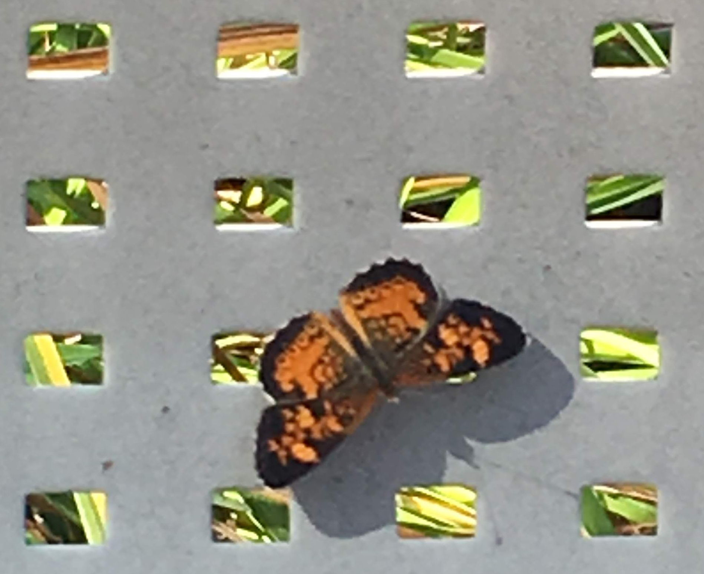

## Colab books of [Dr. Joshua Stough](http://joshuastough.com), Bucknell University

- [Digital Image Processing in Python](https://profstough.github.io/imageprocessing-awesome/)  

If you like what you see, please [let me know](mailto:joshua.stough@bucknell.edu) or 
[buy me a coffee](https://www.buymeacoffee.com/joshuastough).

 

    

